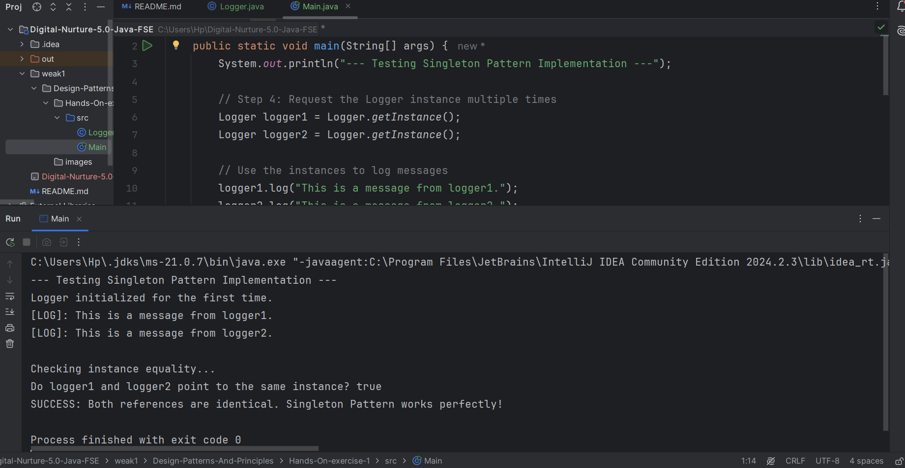
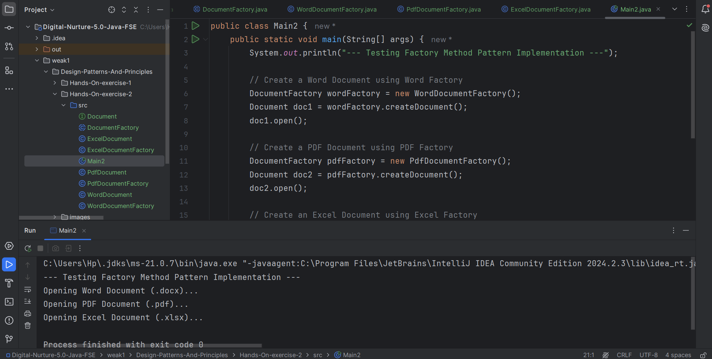

# Module: Design Patterns and Principles

---

## 🔹 Hands-On Exercise 1: Singleton Pattern
**Scenario:** Ensure a logging utility class has only one instance.

### Successful Output:

---

## 🔹 Hands-On Exercise 2: Factory Method Pattern
**Scenario:** Create different types of documents using a Document Factory.

### Successful Output:

