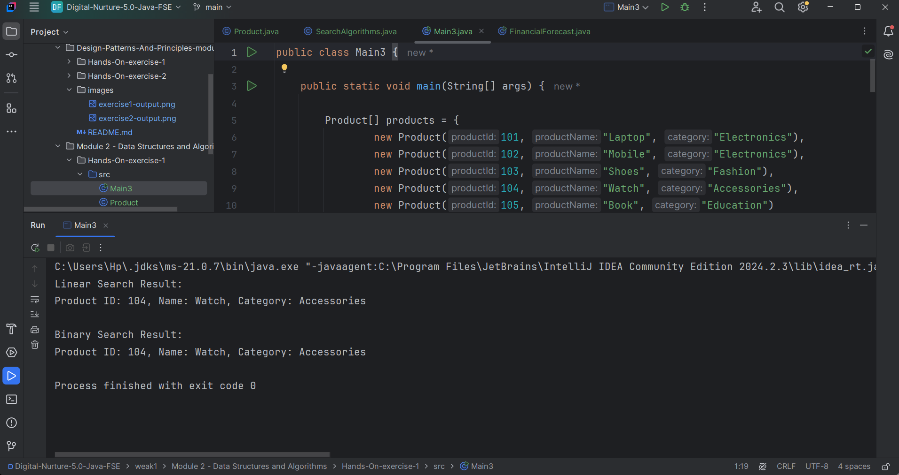
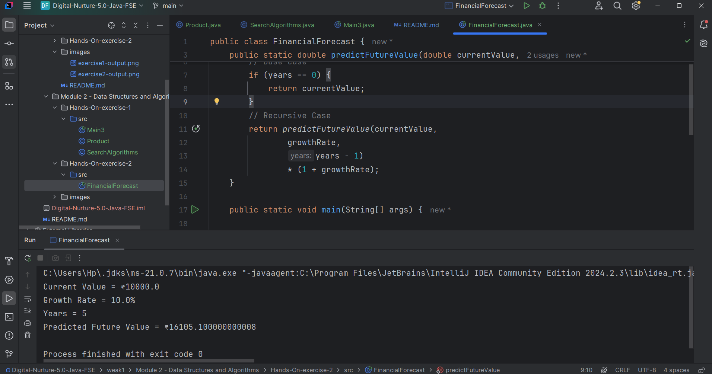

## 🔹 Hands-On Exercise 1: Singleton Pattern
**Scenario:** Linear Search has O(n) time complexity because it checks each product sequentially. Binary Search has O(log n) complexity because it repeatedly divides the search space in half. For an e-commerce platform with a large number of products, Binary Search is more efficient and provides faster search results, provided that the products are stored in sorted order.

### Successful Output:

---

## 🔹 Hands-On Exercise 2: Factory Method Pattern
**Scenario:** Recursion is a technique in which a method calls itself to solve smaller instances of a problem. In this exercise, a recursive algorithm was used to predict future financial values based on a fixed growth rate. The recursive solution has a time complexity of O(n) and space complexity of O(n). For large inputs, recursion can lead to excessive memory usage and stack overflow. An iterative approach or the mathematical compound growth formula can optimize the solution and improve performance.

### Successful Output:
