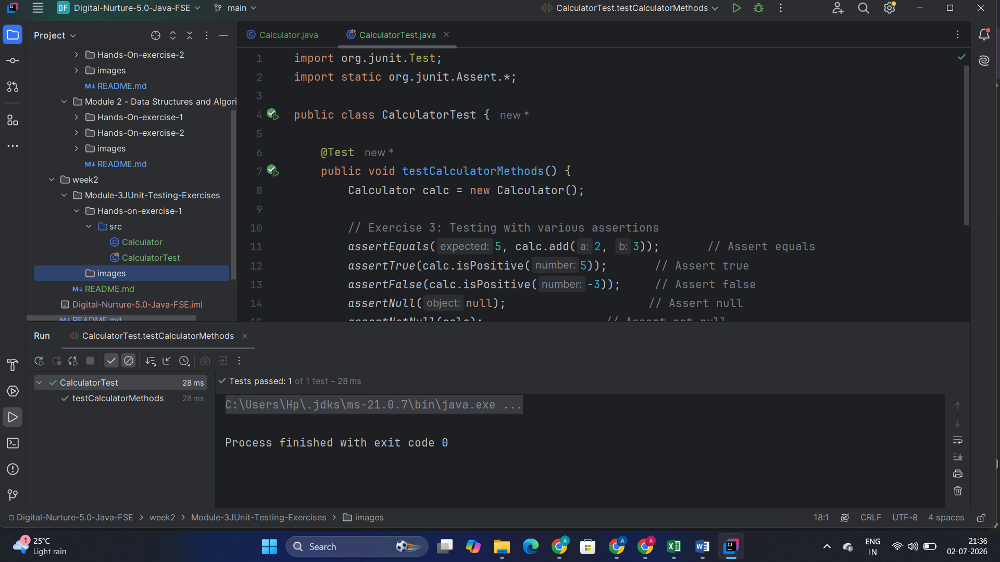
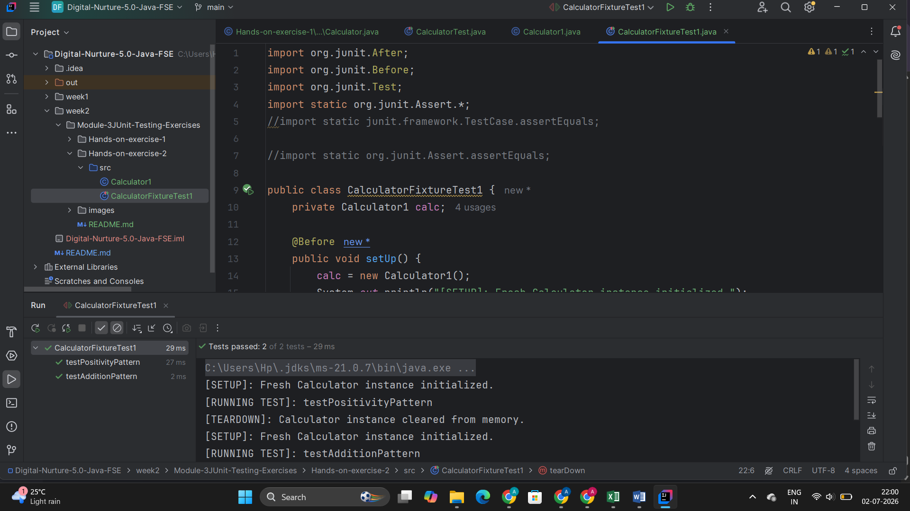

# Week 2: JUnit Testing Exercises

---

## 🔹 Hands-On Exercise 1: JUnit Setup and Assertions
**Scenario:** Set up basic unit tests and verify code logic using a variety of core JUnit assertions.

### Execution Output:

---

## 🔹 Hands-On Exercise 2: Arrange-Act-Assert (AAA) and Test Fixtures
**Scenario:** Structure test logic cleanly using the AAA pattern while managing resource lifecycles through setup and teardown lifecycle hooks.

### Execution Output:

