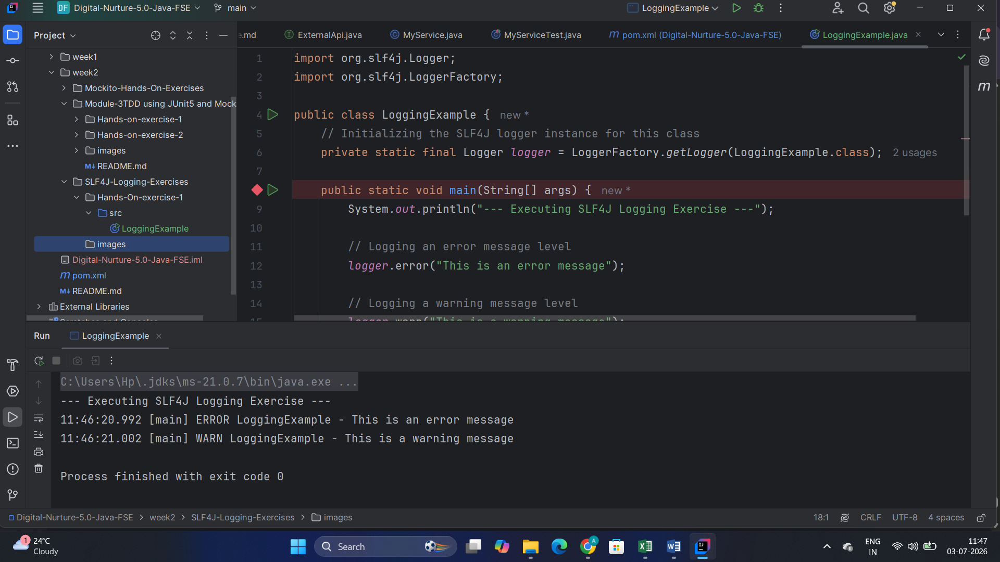

# Week 2: SLF4J and Logback Logging Exercises

---

## 🔹 Hands-On Exercise 1: Logging Error and Warning Levels
**Scenario:** Configure SLF4J API with a Logback classic provider to output error and warning tracking data streams to the application console.

### Execution Output:
The logging statements compiled and printed successfully in the terminal:

